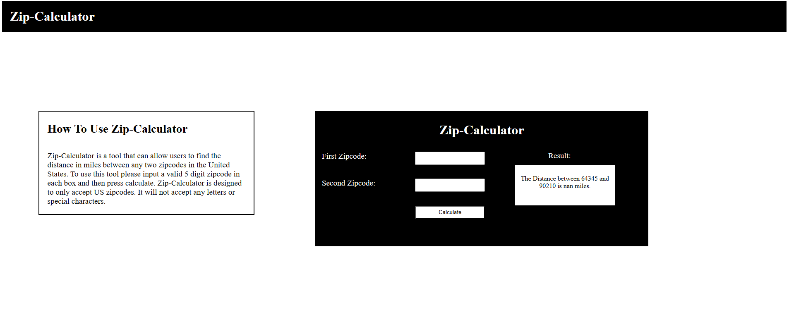

<h1>Zip Calculator</h1>

<h2>Program Description</h2>
<h3>Zip Calculator is an app that allows users to input two valid US zipcodes and find the distance between them.</h3>
<h2>How does it Work?</h2>
<h4>-Zip-calculator uses Python, HTML, CSS, and Django, to enable the calculator to be user accessible.</h4>
 <h4>-Python is used to import pgeocode to identify the "US" as the object of the database so that it pulls the coordinates for all zipcodes in the United States.</h4>
<h4>-The program has set conditions that allows users to only input valid 5 digit US zipcodes.</h4>
<h4>- The program will produce an error message for any invalid zip codes, letters
or special characters.</h4>
<h4>-The program uses a distance_calculator function to pull the zip codes that users input from the HTML/CSS user interface through a get request, and uses the command "dist.quary_postal_code(zip1,zip2
to calcute the distances between the two zipcodes.</h4>
<h4>-The pgeocode's outputs inside of kilometers, so the program converts the output into miles, before displaying to users.</h4>
<h2>What to import</h2>
<h4>-pgeocode</h4>
<h4>-django.http import Http Response</h4>
<h4>-django.shortcuts import render</h4>
<h2>File Guide</h2>
<h4>Python code is in Views.py within zip_app folder</h4>
<h4>HTML and CSS are in first.html within the templates folder</h4>
<h2>Command line for running on computer</h2>
<h4> pip install django </h4>
<h4> git clone https://github.com/Lexi79Ha/zipcode_calculator.git</h4>
<h4>cd zipcode_calculator</h4>
<h4>cd zip_project</h4>
<h4>python manage.py runserver</h4>
<h3>Author</h3>
<h4>Alexis Harris</h4>
<h4>Email: lmh.mo.6@gmail.com</h4>
